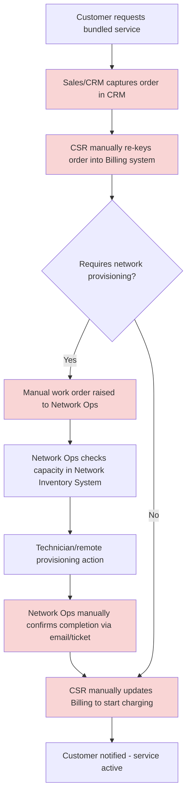

# As-Is Business Architecture

**Phase:** B — Business Architecture

## Overview

Brenmark's business architecture today reflects two decades of independent evolution across three functional silos — Billing/Revenue, Customer Operations, and Network Operations — each with its own systems, its own definition of "product," and its own definition of "customer." There is no shared business process for "sell a converged product" because no single business capability spans all three domains; instead, each domain runs its own end-to-end process for the products it owns, and cross-domain products are handled through ad hoc manual coordination rather than a designed process.

## Order-to-Activation Process (As-Is)

For a standard single-domain product (e.g., a mobile plan), the order process runs largely within one domain and takes hours. For anything spanning domains — most notably any bundle involving broadband, which touches network provisioning — the process becomes a manual relay:

1. **Sales/CRM** captures the order in the CRM system, which has its own product code list not shared with billing or network inventory.
2. A **customer service representative manually re-keys** the order into the billing system using the billing system's separate product code list, translating between the two by institutional knowledge (often undocumented, held by tenured staff).
3. For any service requiring physical/network provisioning, a **separate manual work order** is raised to Network Operations, who consult the network inventory system — which is not connected to either CRM or billing — to check capacity and schedule a technician or remote provisioning action.
4. Network Operations **manually confirms completion** back to Customer Operations, typically via email or a ticketing system that is not integrated with CRM or billing.
5. **Billing is manually updated** to begin charging once Customer Operations receives and relays the network confirmation.

This process takes **3–7 business days** end-to-end for products requiring network provisioning, and involves at minimum three manual handoffs, each a point of delay, transcription error, and lost institutional knowledge risk as tenured staff retire.

## Why Converged Bundles Are Not Possible Today

A converged bundle (mobile + broadband, or mobile + broadband + 5G slice) would require a single order to simultaneously update three systems that share no common product definition, no common customer identifier reconciliation, and no orchestration layer. Today this is not automatable — it would require, in effect, three separate manual orders stitched together by a human, with no way to guarantee consistent pricing, activation timing, or a unified bill. Brenmark's product and commercial teams have confirmed no bundled product has ever shipped because of this constraint, not due to a lack of commercial demand.

## Capability Ownership (As-Is)

| Business Capability | Owning Domain | System(s) of Record |
|---|---|---|
| Customer record management | Customer Operations | CRM (partial), Billing (partial, separate record) |
| Product definition (mobile) | Billing/Revenue | Billing system product tables |
| Product definition (broadband) | Network Operations | Network inventory system |
| Order capture | Customer Operations | CRM |
| Order fulfillment / provisioning | Network Operations | Network inventory / manual work orders |
| Billing & charging | Billing/Revenue | Billing system |
| Case management / support | Customer Operations | CRM |

No capability in this table is shared or jointly governed — each is siloed within its owning domain, which is the structural root cause of the fragmentation described in the Phase A vision and scope.

*(Shaded steps are manual, system-disconnected handoffs — the primary target for elimination in the to-be architecture.)*

## Business Impact Summary

- **Time-to-revenue** for a new provisioned service: 3–7 business days.
- **No converged product** has ever been commercially launched.
- **Manual re-keying error rate** (estimated from Customer Operations incident tickets) contributes to a measurable share of billing dispute volume, though precise attribution is a data-quality gap this program's data architecture (Phase C) is designed to close.
- **Institutional-knowledge risk:** the undocumented product-code translation step (Step 2 above) depends on tenured staff; this is an operational risk independent of the modernization program and a further argument for a single shared catalog.

---

*Fictional case study — see [README](../README.md) for full disclaimer.*
