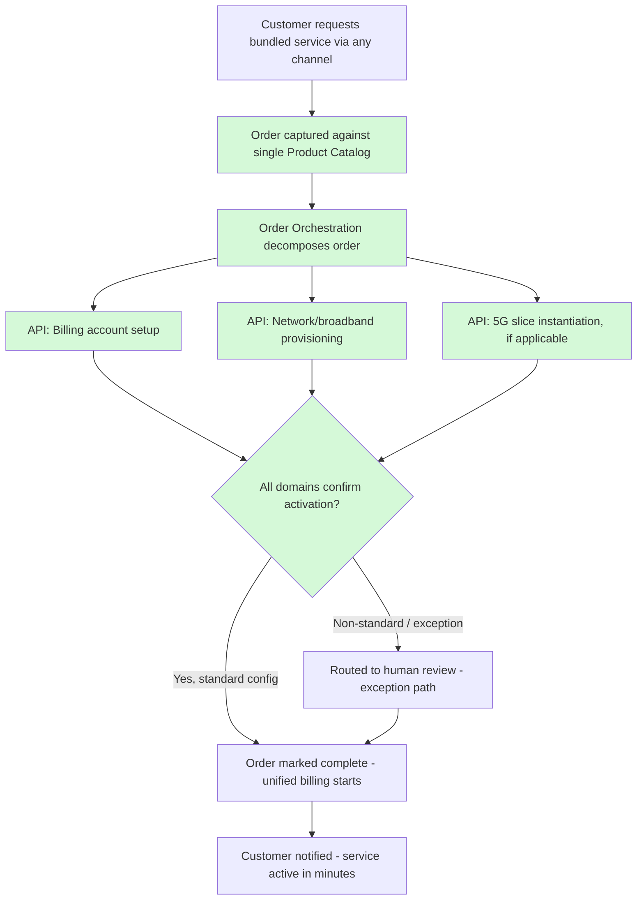

# To-Be Business Architecture

**Phase:** B — Business Architecture

## Overview

The to-be business architecture replaces the three siloed, domain-owned notions of "product" and "customer" with a single shared **Product & Order capability** that sits across Billing, Customer Operations, and Network Operations, exposed through TM Forum Open APIs. Domain systems continue to exist and continue to own domain-specific execution (financial ledger in billing, network device state in network inventory), but they no longer each maintain a private, disconnected definition of what is being sold or who it's being sold to.

This is a business-process redesign as much as a technical one: the manual relay described in the as-is document is replaced by a single order that is decomposed and orchestrated automatically across domains, with each domain system responding to an API call rather than a human re-keying data into it.

## Order-to-Activation Process (To-Be)

1. **Sales/digital channel** captures an order against the single **Product Catalog**, which can describe any product — mobile, broadband, 5G slice, or a bundle of any combination — with one consistent product definition across every channel.
2. The **Order Orchestration** capability decomposes the order into the domain-level actions required (billing account setup, network provisioning, slice instantiation) and issues them as API calls, not manual tickets, to each domain system through the TM Forum Open API gateway.
3. **Billing** receives a structured order-to-charge instruction via API and begins financial account setup without manual re-keying.
4. **Network provisioning** (for broadband or slice products) receives a structured activation request via API; for standard configurations within defined capacity and SLA parameters, provisioning completes automatically without a human work order.
5. **Order Orchestration** tracks completion state across all domains and only marks the order complete — triggering unified billing start — once every domain confirms activation, via API callback rather than email.
6. **Non-standard orders** (unusual configurations, capacity exceptions, custom SLA terms) fall to a defined **exception path** with human review — this is retained by design (P-09), not eliminated, because forcing every edge case through full automation on day one would be its own source of delivery risk.

This reduces standard-configuration order-to-activation from 3–7 business days to a target of **≤ 15 minutes**, and makes converged bundles possible for the first time because a single order can express, and a single orchestration flow can fulfill, a product spanning all three domains.

## Capability Ownership (To-Be)

| Business Capability | Owning Domain (To-Be) | System(s) of Record |
|---|---|---|
| Customer 360 record | Shared (jointly governed, EA-stewarded) | New Customer Domain service (system of record); CRM and Billing become consumers |
| Product catalog (all product types incl. 5G slice) | Shared (jointly governed, Product/Commercial accountable) | New Product Catalog platform |
| Order capture & orchestration | Shared | New Order Orchestration platform |
| Provisioning / activation (network & slice) | Network Operations, automated for standard cases | Network inventory + orchestration integration |
| Billing & charging (financial ledger) | Billing/Revenue (unchanged) | Legacy billing engine, reached via API, not replaced |
| Case management / support | Customer Operations | CRM, now reading Customer 360 rather than its own partial record |

Note that Billing/Revenue retains ownership of the financial ledger unchanged — this is a deliberate scope boundary (see Phase A) — but no longer owns a private, disconnected product definition.

*(Shaded steps are automated, API-driven — replacing the manual handoffs shaded in the as-is diagram. Only the exception path, Step I, retains a manual review step, by design.)*

## Business Impact Summary

- **Converged bundles become commercially launchable**, directly enabling the revenue case in `01-phase-a-vision-and-scope/business-case.md`.
- **5G network slices become sellable products**, satisfying the board's 18-month mandate.
- **Standard provisioning time drops from days to minutes**, removing the largest single source of manual labor cost and customer-experience friction identified in the as-is architecture.
- **The financial ledger is untouched**, preserving audit continuity and avoiding the multi-year risk of a billing-engine replacement — this is the direct business articulation of the strangler-fig decision recorded in ADR-001.
- Capability ownership shifts from **domain-siloed** to **shared/jointly governed** for customer, product, and order — this organizational change is significant enough to require its own change management plan (Phase H), not just a technical rollout.

---

*Fictional case study — see [README](../README.md) for full disclaimer.*
