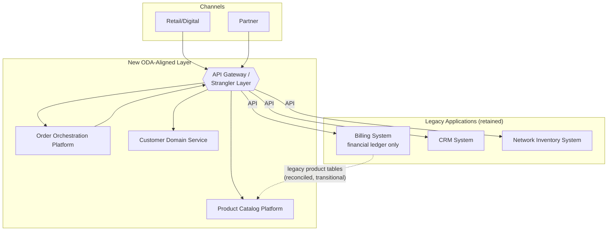

# Application Architecture

**Phase:** C — Information Systems Architecture

## As-Is Application Landscape

Brenmark's current application landscape consists of three large, independently operated applications, each with bespoke point-to-point integrations built over time to cover the most urgent cross-system need at the time they were built — not designed as a coherent integration architecture.

| Application | Role Today | Integration Style |
|---|---|---|
| **Billing System** (monolith) | Financial ledger, real-time charging, mobile product tables | Point-to-point batch file exchange with CRM (nightly); no real-time API |
| **CRM System** | Sales capture, case management, own customer record | Point-to-point batch/nightly sync to Billing; manual data entry to Network Inventory (no integration) |
| **Network Inventory / Order Management System** | Network resource tracking, broadband service definitions, manual work-order queue | No integration to Billing or CRM; work orders raised and closed manually via ticketing |

This landscape has no API gateway, no service catalog, and no consistent authentication/authorization model across systems — access control is managed independently per application. The absence of any TM Forum ODA alignment means there is no common functional decomposition (e.g., no distinct "Product Catalog" or "Order Management" component) — catalog and order logic are embedded inside Billing and CRM respectively as monolithic internal modules.

## To-Be Application Landscape (ODA-Aligned)

The to-be application architecture introduces three new components aligned to TM Forum ODA functional blocks, connected to the retained legacy applications through a governed API gateway rather than new point-to-point links:

| Application | ODA Alignment | Role |
|---|---|---|
| **Product Catalog Platform** (new) | Core Commerce Management — Product Catalog | Single authoritative product/pricing/bundle definition, exposed via Open API to all channels and to Order Orchestration |
| **Order Orchestration Platform** (new) | Production — Order Management | Order lifecycle management, decomposition, and cross-domain fulfillment orchestration |
| **API Gateway / Strangler Layer** (new) | Common Domain — API/Integration Management | Enforces P-02 (Open API standard) and P-10 (integration inventory); the single ingress/egress point between new and legacy applications |
| **Billing System** (retained) | Core Commerce Management — Billing (financial ledger only) | Reached only via API through the gateway; internal product-table logic deprecated in favor of the Product Catalog platform, per the migration plan in Phase F |
| **CRM System** (retained) | Party Management (Engaged Party) | Becomes a consumer of the Customer Domain service and Order Orchestration rather than an independent order/product source |
| **Network Inventory System** (retained) | Production — Resource Management | Exposed via API for capacity checks and activation, replacing manual work-order tickets for standard configurations |
| **Customer Domain Service** (new) | Party Management — Customer | Single authoritative customer record; CRM and Billing become consumers |

## Integration Pattern: Strangler Fig via API Gateway

The defining architectural move in this program is placing the API Gateway/Strangler Layer between every new component and every legacy application, rather than allowing new components to integrate directly and bespoke-ly with legacy internals. Concretely: the Product Catalog platform never writes directly into the Billing system's product tables; it publishes catalog data through the gateway, and a reconciliation job (see `data-architecture.md` and ADR-004) keeps the legacy tables consistent during the transition. This means the legacy applications' internal complexity is never a blocker to building new capability, and legacy capability can be retired behind the gateway's stable API contract without new components needing to change when that retirement happens — the gateway's API contract, not the legacy application's internals, is what new components depend on.

## Why Legacy Applications Are Not Replaced Wholesale

This is the application-architecture articulation of the strategy decided in ADR-001. Replacing the Billing system's financial ledger wholesale was seriously evaluated and rejected: a full core-billing replacement for a 6M-subscriber real-time-charging system is a multi-year, high-risk undertaking incompatible with an 18-month capability deadline, and it would put the program's success at the mercy of a single very large cutover event rather than a sequence of independently valuable, reversible waves (per principle P-03 and P-04). The API Gateway/Strangler pattern lets Brenmark ship the ODA-aligned new capability (catalog, orchestration, customer domain) on its own schedule, decoupled from the legacy applications' internal release cycles.

## Application Rationalization Roadmap (Summary)

Full sequencing is in `06-phase-f-migration-planning/migration-roadmap.md`; at the application-architecture level, the intended end state (beyond this program's 18-month horizon) is that the Billing system's product-table module and the CRM's independent order-capture module are formally retired once the reconciliation job in ADR-004 is no longer needed — an outcome this program enables but does not commit to completing within 18 months (see Phase A scope boundaries).

---

*Fictional case study — see [README](../README.md) for full disclaimer.*
