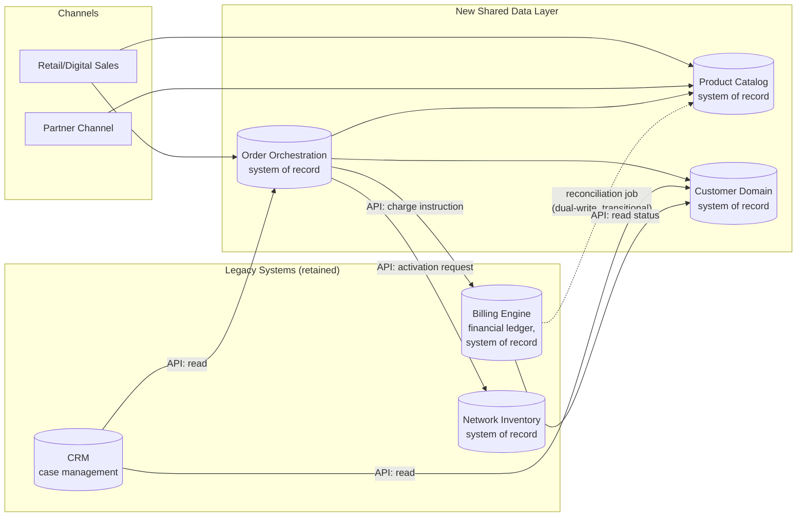

# Data Architecture

**Phase:** C — Information Systems Architecture

## Overview

The core data-architecture problem this program solves is that **Customer, Product, and Order are each represented as three incompatible, disconnected data models today** — one partial view per domain system, with no shared identifier or entity definition. This document defines the as-is data landscape, the to-be target data domains and systems of record, and the integration pattern that connects them without requiring a disruptive migration of the billing system's underlying data store.

## As-Is Data Landscape

| Domain | System(s) holding data today | Problem |
|---|---|---|
| Customer | CRM (sales/case record), Billing (financial account record) | Two separate customer records, reconciled only by manual lookup (often by phone number or account number typed across systems); no shared unique customer ID. |
| Product | Billing (product/pricing tables, mobile-focused), Network inventory (broadband service definitions) | No concept of "product" spans both; a bundle cannot be expressed because no single table or system defines both halves. |
| Order | CRM (order capture), manual work-order tickets (network provisioning), Billing (activation record) | Order state is fragmented across three places with no single order-lifecycle record; status must be manually cross-checked. |
| Network Inventory | Network inventory system | Reasonably complete for its own domain, but not exposed to billing or CRM for real-time capacity or activation status. |

## To-Be Target Data Domains

| Domain | Target System of Record | Consumers |
|---|---|---|
| **Customer** | New Customer Domain service (single authoritative record, unique customer ID) | CRM, Billing, Order Orchestration — all become consumers via API, not independent owners |
| **Product Catalog** | New Product Catalog platform (TM Forum Open API–aligned, TMF620/TMF622-pattern) | All sales channels, Order Orchestration, Billing (for rating reference) |
| **Order** | New Order Orchestration platform (single order-lifecycle record, TMF622-pattern) | Billing, Network provisioning systems, Customer Operations dashboards |
| **Network Inventory** | Existing Network Inventory system (retained; exposed via API rather than replaced) | Order Orchestration (for capacity/activation), Product Catalog (for network-dependent product feasibility) |
| **Financial Ledger** | Existing Billing engine (retained, unchanged system of record per Phase A scope) | Order Orchestration (writes charge instructions), Customer Operations (reads billing status) |

Per architecture principle P-01, no domain listed above may have more than one system of record; every other system consuming that domain's data does so through a governed API, not a private copy.

## Key Entities (Target Model, Simplified)

- **Customer**: `customerId` (new global identifier), legal name, billing address(es), linked accounts (billing account ref, CRM case ref), consent/privacy flags.
- **Product**: `productId`, product type (mobile | broadband | 5G-slice | bundle), pricing reference, SLA parameters (critically including slice capacity/latency/throughput parameters per P-08), bundle composition (list of constituent `productId`s where type = bundle).
- **Order**: `orderId`, `customerId`, ordered `productId`(s), order status (lifecycle state machine: captured → decomposed → in-fulfillment → active → billed), per-domain fulfillment sub-status (billing, network, slice).
- **Network Inventory Reference**: `resourceId`, capacity/availability, linked `orderId` when reserved/active.

## Integration Pattern

The to-be data architecture is connected through an **API gateway acting as a strangler-fig layer** in front of the legacy billing and network inventory systems (full detail in `04-phase-d-technology-architecture/reference-architecture.md`). The pattern is event-and-API hybrid:

- **Synchronous API calls** (TM Forum Open API-styled REST) for order capture, catalog lookups, and activation requests — used where the caller needs an immediate response (e.g., checking network capacity before confirming an order).
- **Asynchronous events** for state-change propagation (e.g., "order activated," "billing account created") consumed by the Order Orchestration platform to advance the order lifecycle state machine, decoupling domain systems from each other's response times.
- **Dual-write reconciliation** during the transition period: because the legacy billing system's own product tables cannot be immediately retired, the Product Catalog platform is authoritative and the legacy billing product tables are updated by a scheduled reconciliation job rather than becoming a second authoritative source. This reconciliation strategy, its consistency model, and its retirement timeline are the subject of ADR-004, given the operational overhead it introduces (quantified in the business case at ~15% during the transition).

## Data Governance

The Head of Data & Analytics is accountable for data quality across the new shared domains (per the Phase A RACI), with the EA function stewarding the entity models themselves. Every new consumer of Customer, Product, or Order data must be registered in the integration inventory (P-10) and access-controlled per the classification rules in P-06 — customer location-adjacent data (network-slice usage telemetry) is classified sensitive PII by default and requires explicit InfoSec sign-off before a new consumer is onboarded.

---

*Fictional case study — see [README](../README.md) for full disclaimer.*
