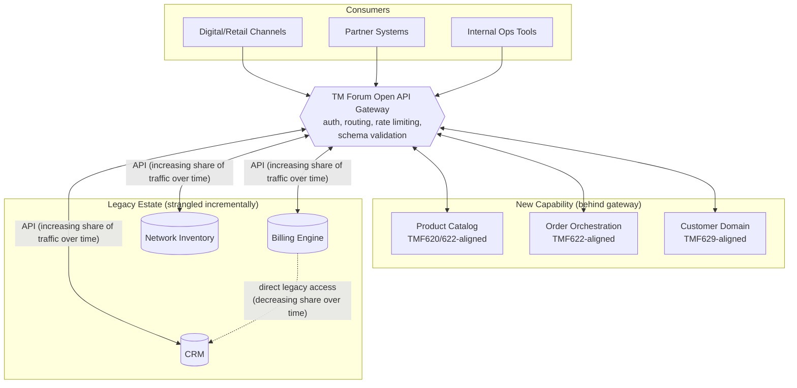

# Reference Architecture: TM Forum Open API Strangler-Fig Layer

**Phase:** D — Technology Architecture

## Pattern Summary

This reference architecture places a TM Forum Open API–conformant gateway between Brenmark's channels/new components and its legacy BSS/OSS estate (Billing, CRM, Network Inventory). New capability is built behind the gateway's stable API contract; legacy systems are incrementally "strangled" — their responsibilities migrated out from under them one capability at a time — rather than replaced in a single cutover. This is the technology-architecture instantiation of the business and application decisions made in Phases B and C, and the subject of ADR-001.

The dotted line represents the shrinking set of direct legacy-to-legacy integrations that exist today and are targeted for retirement (per P-10); as each is retired, its traffic is re-routed through the gateway, and the underlying legacy capability becomes a candidate for eventual decommissioning.

## Applicability Conditions

This pattern is the right choice when the following conditions hold — all of them held true for Brenmark at Phase A:

1. **The legacy system(s) are revenue-critical and cannot tolerate a high-risk big-bang cutover.** Brenmark's billing engine performs real-time charging for 6M subscribers; any cutover approach carries unacceptable business-continuity risk (P-03).
2. **There is a hard external deadline that a multi-year replacement cannot meet.** The board's 18-month 5G-slicing mandate rules out any strategy whose first commercial value lands after month 18.
3. **The new capability needed (converged bundles, slice monetization) is additive to, not a full replacement of, existing legacy function** — Brenmark needs a new product/order layer, not a new financial ledger.
4. **The organization can tolerate a bounded period of dual-write/reconciliation complexity** in exchange for avoiding cutover risk — Brenmark's business case accepts a ~15% operational overhead for ~24 months as a quantified, budgeted cost (see `01-phase-a-vision-and-scope/business-case.md` and ADR-004), not an open-ended one.
5. **A standards body (TM Forum) already defines the target API contracts**, so the gateway's contract isn't a bespoke design risk in itself.

## When NOT to Use This Pattern

This pattern is not universally correct, and an architect proposing it should be able to articulate when it is the *wrong* choice. Do not use a strangler-fig gateway approach when:

- **The legacy system's internal data model is too corrupted or undocumented to reconcile against.** If the legacy system cannot produce a reliable enough feed for dual-write reconciliation (ADR-004 depends on this being feasible for Brenmark's billing product tables), the strangler pattern degrades into permanent data-quality risk rather than a bounded transition — in that scenario, a rip-and-replace with a clean data migration, despite its cost and cutover risk, may be the safer choice.
- **There is no hard deadline forcing incremental delivery**, and the organization can afford the multi-year timeline and cutover risk of a full replacement in exchange for a permanently simpler end-state architecture with no legacy estate to maintain at all. Brenmark's 18-month mandate rules this out, but a different organization without that deadline pressure might reasonably choose rip-and-replace instead.
- **The legacy system is being sunset for unrelated commercial reasons anyway** (e.g., a planned divestiture or platform consolidation already underway) — in that case, investing in a strangler layer around a system already scheduled for retirement is wasted architecture effort; wait for the retirement or accelerate it directly.
- **Regulatory or contractual constraints require a single authoritative system with no intermediate dual-write state** — some financial or safety-critical domains require exactly one system of record at all times with no reconciliation window; if Brenmark's billing regulator required this (it does not, per Phase A scope confirmation with Compliance), the strangler pattern's transitional dual-write period would be a compliance violation, not just an operational cost.
- **The team lacks the discipline to actually retire legacy capability once strangled.** The strangler pattern's benefit depends on capability genuinely moving off legacy systems over time (per the application rationalization roadmap in Phase C); if an organization builds the gateway but never migrates capability behind it, it ends up maintaining the legacy estate *and* a new integration layer indefinitely — a worse outcome than either alternative. This is a governance risk, not a technology risk, and is why Phase G's implementation governance explicitly tracks legacy-traffic-share-through-gateway as a compliance metric, not just a delivery milestone.

## Non-Functional Requirements for the Gateway Layer

| NFR | Target | Rationale |
|---|---|---|
| Availability | 99.95% | Gateway sits in the path of all order and catalog traffic; an outage blocks new sales entirely (binding per P-11). |
| P95 API latency (catalog read) | ≤ 200ms | Digital channel UX requirement for real-time product browsing. |
| P95 API latency (order submission) | ≤ 800ms | Order submission includes synchronous capacity check; must feel instantaneous to a sales agent. |
| Schema conformance | 100% TM Forum Open API schema validation at gateway ingress | Enforces P-02; non-conformant traffic is rejected, not silently passed through. |

---

*Fictional case study — see [README](../README.md) for full disclaimer.*
