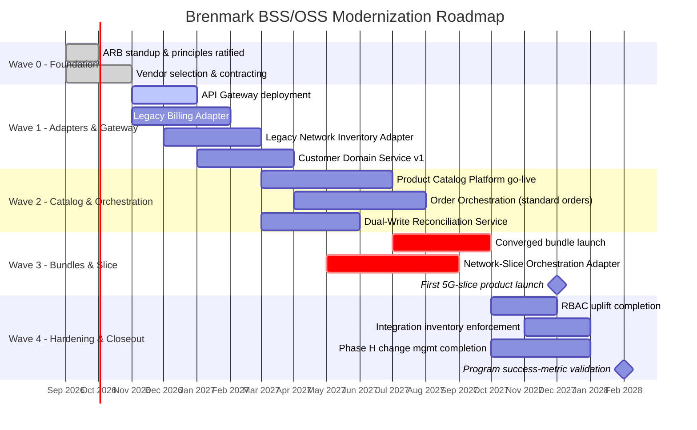

# Migration Roadmap

**Phase:** F — Migration Planning

## Sequencing Principle

The roadmap is organized into four waves across 18 months, sequenced by the dependency structure surfaced in Phase E (legacy adapters before platforms that depend on them) and by priority score (highest-priority gaps land in the earliest wave that can technically absorb them). Each wave is designed to be independently valuable — per P-03, no wave depends on a future wave to deliver *some* measurable business benefit, even though full converged-bundle and slice capability only lands once Wave 3 completes.

## Roadmap by Wave

| Wave | Timeframe | Primary Deliverables | Gaps Closed | Business Value Delivered |
|---|---|---|---|---|
| **Wave 0 — Foundation** | Months 1–3 | ARB stood up; architecture principles ratified; vendor selection (Product Catalog/Order Orchestration) completed and contracted; integration inventory baseline established | G-09 (partial) | Governance and vendor foundation in place; no customer-facing change yet |
| **Wave 1 — Adapters & Gateway** | Months 3–7 | API Gateway/Strangler Layer deployed; Legacy Billing Adapter and Legacy Network Inventory Adapter built and tested; Customer Domain Service (v1) live, reconciling CRM/Billing customer records | G-05, G-06, G-04 | Legacy systems become API-addressable for the first time; foundation for every subsequent wave |
| **Wave 2 — Catalog & Orchestration Core** | Months 6–12 | Product Catalog Platform live (single mobile + broadband product definitions migrated in); Order Orchestration Platform live for standard single-domain orders; Dual-Write Reconciliation Service live | G-01 (core), G-02 (core), G-07 | First automated (non-bundle) order-to-activation flows go live; provisioning time begins dropping for in-scope product types |
| **Wave 3 — Converged Bundles & Slice Monetization** | Months 10–16 | Converged bundle products defined and launched in Product Catalog; cross-domain orchestration for bundles live; Network-Slice Orchestration Adapter live; first 5G-slice product launched | G-01 (complete), G-02 (complete), G-03, G-11 | Board mandate met — first converged bundle and first slice product commercially available |
| **Wave 4 — Hardening & Governance Closeout** | Months 15–18 | RBAC/access control uplift completed across all new components; integration inventory fully populated and enforced; Phase H change management activities completed; quarterly health review confirms success metrics from Phase A | G-08, G-09 (complete), G-10 | Program-level success metrics (Phase A) validated; governance operating model handed to steady-state ARB cadence |

Waves overlap intentionally (e.g., Wave 2 begins before Wave 1 fully closes) where dependencies allow, to compress the overall timeline against the 18-month deadline — this is reflected in the Gantt chart below.

*(Dates are illustrative, anchored to a hypothetical September 2026 program start to align the 18-month mandate deadline with the 5G-slice launch milestone shown above.)*

## Roadmap Governance

Wave transitions require ARB sign-off (per `00-preliminary/governance-framework-setup.md`), and each wave's go-live is subject to the VP Billing & Revenue Systems sign-off requirement recorded in the Phase A RACI, given billing's business-continuity exposure. Roadmap variance exceeding 4 weeks against any wave's committed date triggers a mandatory review at the next standing ARB session; variance exceeding 8 weeks against the Wave 3 slice-launch milestone triggers escalation to the CTO and Board Technology Committee, since that milestone is the direct fulfillment of the board's mandate.

---

*Fictional case study — see [README](../README.md) for full disclaimer.*
